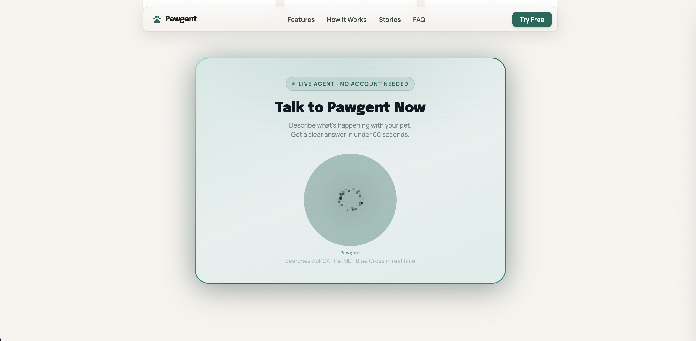

# 🐾 PawSOS — Pet Emergency Voice Assistant

A voice-first emergency assistant that helps pet owners triage pet emergencies, get first-aid guidance from trusted veterinary sources, and find nearby emergency vets — all in a single conversation.



## Tech Stack

- **Voice AI:** ElevenLabs ElevenAgents
- **Real-time Search:** Firecrawl Search API
- **Backend:** Node.js + Express
- **Frontend:** Vanilla HTML/CSS/JS
- **Sources:** ASPCA, PetMD, Blue Cross UK

## How It Works

1. **Speak** — Describe your pet's emergency
2. **Triage** — Agent searches trusted vet sources and classifies severity (🔴 EMERGENCY / 🟡 URGENT / 🟢 MONITOR)
3. **First Aid** — Get immediate action steps
4. **Find a Vet** — Say your city, get 3 emergency vets with phone numbers

## Setup

### Backend

```bash
cd backend
cp .env.example .env
# Add your API keys to .env
npm install
npm start
```

### Frontend

Open `frontend/index.html` in a browser, or deploy to Vercel.

Add `?demo=true` to the URL to run a simulated demo without ElevenLabs.

### ElevenAgents

1. Go to [elevenlabs.io/agents](https://elevenlabs.io/agents) → Create Agent
2. Copy system prompt from `elevenlabs-config/agent-config.json`
3. Add tools: `symptom_search` + `vet_finder` with your backend webhook URLs
4. Copy Agent ID → update `AGENT_ID` in `frontend/index.html` or pass as `?agentId=xxx`

## Deploy

- **Backend:** [Railway](https://railway.app) — deploy from GitHub, add env vars, start command: `node backend/server.js`
- **Frontend:** [Vercel](https://vercel.com) — drag and drop `frontend/` folder

## Animals Supported

Dogs, cats, rabbits, hamsters, parrots, reptiles

## Built For

**ElevenHacks Season 1, Hack #1: Firecrawl x ElevenLabs**
[hacks.elevenlabs.io](https://hacks.elevenlabs.io)
